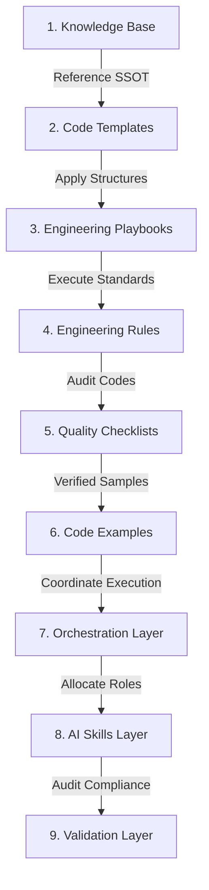

# Framework Dependency Graph - RemoteFix

```mermaid
graph TD
    Knowledge[1. Knowledge Base] -->|Reference SSOT| Templates[2. Code Templates]
    Templates -->|Apply Structures| Playbooks[3. Engineering Playbooks]
    Playbooks -->|Execute Standards| Rules[4. Engineering Rules]
    Rules -->|Audit Codes| Checks[5. Quality Checklists]
    Checks -->|Verified Samples| Examples[6. Code Examples]
    Examples -->|Coordinate Execution| Orchestration[7. Orchestration Layer]
    Orchestration -->|Allocate Roles| Skills[8. AI Skills Layer]
    Skills -->|Audit Compliance| Validation[9. Validation Layer]
```
