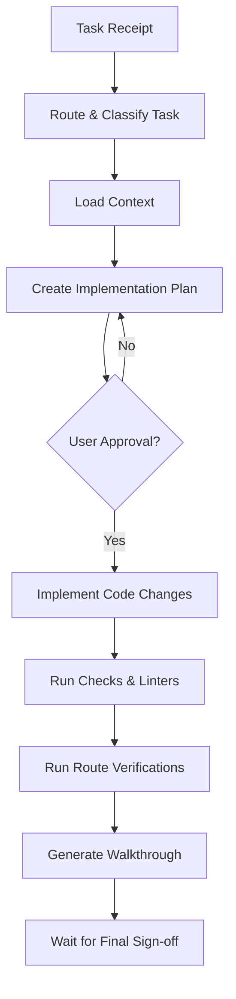

# Execution Pipeline - RemoteFix

## Purpose
Define the chronological pipeline of execution phases from task receipt to completion.

## Scope
Governs agent actions during code edits.

## Overview
The execution pipeline enforces planning, validation, and checklist runs to prevent regressions.

## Standards

### Execution Steps
1. **Understand Task**: Parse intent using task routing rules.
2. **Load Context**: Retrieve target files and rules.
3. **Select Templates**: Identify blueprints from `templates/`.
4. **Create Plan**: Write to `implementation_plan.md` and await approval.
5. **Implement**: Modify source code.
6. **Run Checks**: Enforce compliance using lists from `checks/`.
7. **Run Verification**: Execute the Hono test suite locally.
8. **Summarize**: Update `walkthrough.md`.

## Examples
- *Execution trigger*: Feature request -> Create branch feature/amc -> Deploy schema changes -> Write tests -> Validate.

## Related Documents
- [planning.md](file:///e:/SURAJ/REMOTEFIX-/.agents/orchestration/planning.md)
- [verification.md](file:///e:/SURAJ/REMOTEFIX-/.agents/orchestration/verification.md)

## Status
Verified (Implemented)

## Last Updated
2026-07-31

## Source of Truth
`package.json` (build scripts pipeline)
