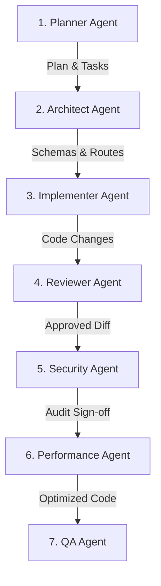

# Agent Handoff Protocols - RemoteFix

## Purpose
Define inputs, outputs, and statuses passed between specialized agents during development.

## Scope
Applies to multi-agent workspaces coordination.

## Overview
Agents operate in sequences, passing structured status payloads to maintain context consistency.

## Standards

### Handoff Flow

### Handoff Parameters

| Agent | Input | Output / Artifact | Status Tag |
| :--- | :--- | :--- | :--- |
| **Planner** | User request | `implementation_plan.md`, `task.md` | `planned` |
| **Architect** | Approved plan | Schema design patterns | `designed` |
| **Implementer** | Schema & plan | Modified code changes | `implemented` |
| **Reviewer** | Modified code | Approved diff review reports | `reviewed` |
| **Security** | Approved diff | Security audit sign-offs | `secured` |
| **Performance** | Secured code | Performance metrics reports | `optimized` |
| **QA** | Optimized code | `walkthrough.md` | `verified` |

## Examples
- *Handoff state*: Planner creates `task.md` and hands off to Architect with status `planned`.

## Related Documents
- [execution.md](file:///e:/SURAJ/REMOTEFIX-/.agents/orchestration/execution.md)

## Status
Verified (Implemented)

## Last Updated
2026-07-31

## Source of Truth
`.agents/prompts/` (agent roles definition)
