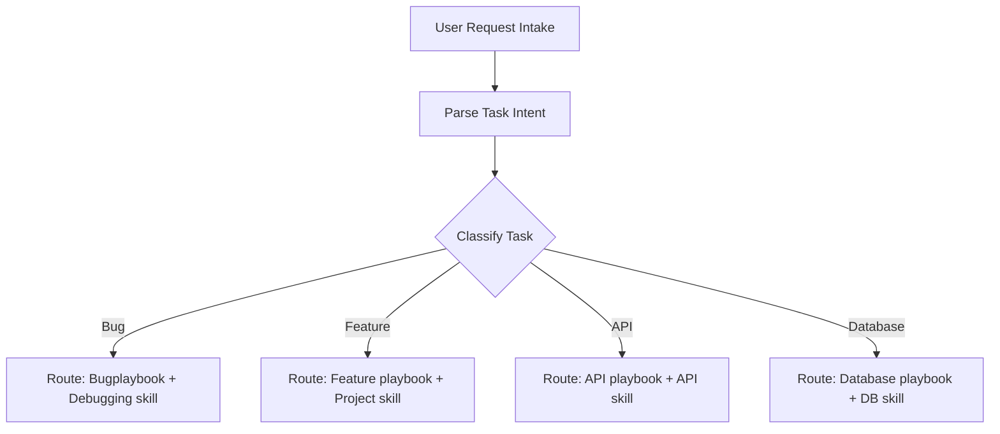

# Task Routing Engine - RemoteFix

## Purpose
Determine the class of incoming engineering tasks and route them to appropriate assets, checks, and playbooks.

## Scope
Governs all task intakes and initial agent allocations.

## Overview
Tasks are analyzed on intake and categorized into one of 13 standard classes to determine their routing parameters.

## Standards

### Task Routing Map

| Task Class | Required Knowledge | Required Templates | Required Playbook | Required Rules | Required Checks | Recommended Skills |
| :--- | :--- | :--- | :--- | :--- | :--- | :--- |
| **Bug** | [logging.md](../logging.md) | [test-template.md](../templates/test-template.md) | [bug-fix.md](../playbooks/bug-fix.md) | [testing.md](../rules/testing.md) | [backend.md](../checks/backend.md) | `debugging` |
| **Feature** | [product.md](../product.md) | [react-component.md](../templates/react-component.md) | [new-feature.md](../playbooks/new-feature.md) | [react.md](../rules/react.md) | [frontend.md](../checks/frontend.md) | `remotefix-project` |
| **API** | [api-guidelines.md](../api-guidelines.md) | [api-template.md](../templates/api-template.md) | [new-api.md](../playbooks/new-api.md) | [api.md](../rules/api.md) | [api.md](../checks/api.md) | `api` |
| **Database** | [database.md](../database.md) | [schema-template.md](../templates/schema-template.md) | [database-change.md](../playbooks/database-change.md) | [database.md](../rules/database.md) | [database.md](../checks/database.md) | `database` |
| **Security** | [security.md](../security.md) | [prompt-template.md](../templates/prompt-template.md) | [security-review.md](../playbooks/security-review.md) | [security.md](../rules/security.md) | [security.md](../checks/security.md) | `security` |
| **Frontend** | [tech-stack.md](../tech-stack.md) | [react-component.md](../templates/react-component.md) | [new-component.md](../playbooks/new-component.md) | [react.md](../rules/react.md) | [frontend.md](../checks/frontend.md) | `frontend` |
| **Backend** | [architecture.md](../architecture.md) | [service-template.md](../templates/service-template.md) | [new-service.md](../playbooks/new-service.md) | [typescript.md](../rules/typescript.md) | [backend.md](../checks/backend.md) | `backend` |
| **Deployment** | [deployment.md](../deployment.md) | [wrangler-template.md](../templates/wrangler-template.md) | [production-release.md](../playbooks/production-release.md) | [git.md](../rules/git.md) | [pre-release.md](../checks/pre-release.md) | `deployment` |
| **Infrastructure** | [deployment.md](../deployment.md) | [docker-template.md](../templates/docker-template.md) | [production-release.md](../playbooks/production-release.md) | [git.md](../rules/git.md) | [production.md](../checks/production.md) | `docker` |
| **Documentation** | [glossary.md](../glossary.md) | [prompt-template.md](../templates/prompt-template.md) | [new-feature.md](../playbooks/new-feature.md) | [naming.md](../rules/naming.md) | [pre-commit.md](../checks/pre-commit.md) | `documentation` |
| **Refactoring** | [coding-standards.md](../coding-standards.md) | [service-template.md](../templates/service-template.md) | [new-service.md](../playbooks/new-service.md) | [naming.md](../rules/naming.md) | [pre-pr.md](../checks/pre-pr.md) | `refactoring` |
| **Testing** | [devops.md](../devops.md) | [test-template.md](../templates/test-template.md) | [bug-fix.md](../playbooks/bug-fix.md) | [testing.md](../rules/testing.md) | [pre-commit.md](../checks/pre-commit.md) | `testing` |
| **Optimization** | [tech-stack.md](../tech-stack.md) | [hook-template.md](../templates/hook-template.md) | [performance.md](../playbooks/performance.md) | [performance.md](../rules/performance.md) | [frontend.md](../checks/frontend.md) | `optimization` |

## Examples
- *Intake*: "The customer mobile sync fails on signature upload." -> Route to **Bug** category. Assign [bug-fix.md](../playbooks/bug-fix.md) and recommended `debugging` skill.

## Related Documents
- [context-loading.md](file:///e:/SURAJ/REMOTEFIX-/.agents/orchestration/context-loading.md)
- [execution.md](file:///e:/SURAJ/REMOTEFIX-/.agents/orchestration/execution.md)

## Status
Verified (Implemented)

## Last Updated
2026-07-31

## Source of Truth
`tests/rc_suite.test.ts` (test cases mapping)
