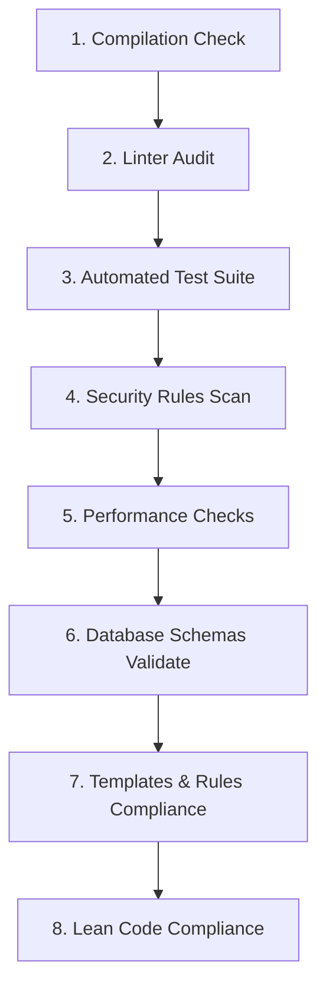

# Verification Hierarchy - RemoteFix

## Purpose
Define the checking sequence required to certify code changes.

## Scope
Applies to verification walkthroughs and local compilation runs.

## Overview
Verification must occur in a strict hierarchical sequence, failing fast if core steps fail.

## Standards

### Verification Hierarchy

1. **Compilation**: Enforce typecheck compiles: `npm run typecheck`.
2. **Lint**: Run ESLint checks across workspaces.
3. **Tests**: Execute integration test runners: `npm run test`.
4. **Security**: Validate RBAC middleware calls on new routes.
5. **Performance**: Ensure maximum pool sizes are not exceeded.
6. **Database**: Check that clustered indexes are present on new tables.
7. **Compliance**: Verify edits match rules in `rules/` and templates in `templates/`.
8. **Lean**: Verify Lean Code Compliance (no duplicate implementations, no unnecessary files, no dead code, no duplicate utilities, minimal abstractions).

## Examples
- *Verification check run*: If `npm run typecheck` fails, halt the pipeline and revert changes.

## Related Documents
- [execution.md](file:///e:/SURAJ/REMOTEFIX-/.agents/orchestration/execution.md)

## Status
Verified (Implemented)

## Last Updated
2026-07-31

## Source of Truth
`tests/rc_suite.test.ts` (test cases)
