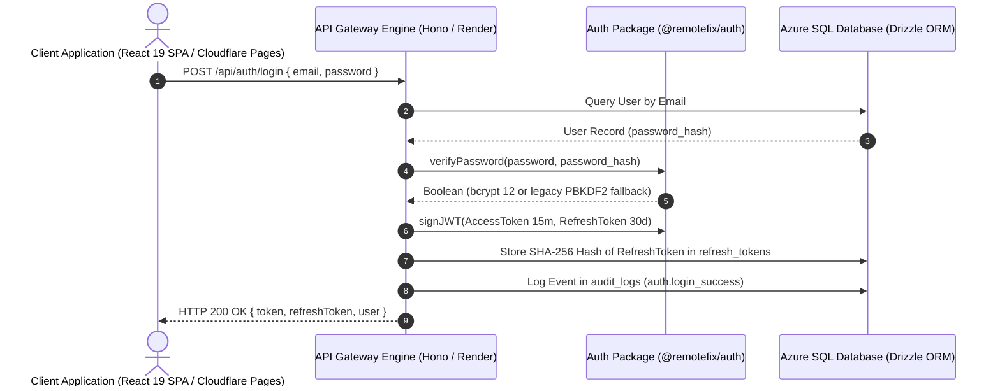

# RemoteFix Enterprise Authentication & RBAC Architecture

Comprehensive documentation for the production authentication system operating across the RemoteFix Enterprise monorepo (`@remotefix/auth`, `@remotefix/database`, `apps/api`, `apps/web`).

---

## 1. System Architecture Overview



---

## 2. Token Lifetime & Security Policies

### 2.1 Access Token (15-Minute Expiry)
- **Algorithm**: HMAC-SHA256 (`HS256`).
- **Payload**:
  - `id`: User UUID
  - `email`: User email address
  - `role`: Role string (`customer` | `engineer` | `admin` | `super_admin` | `org_admin`)
  - `type`: `"access"`
  - `iat`: Timestamp (seconds)
  - `exp`: Timestamp (seconds = `now + 900`)
- **Storage**: In-memory React State via `AuthContext`, stored transiently in `localStorage` (`rf_token`).

### 2.2 Refresh Token (30-Day Expiry) with Rotation
- **Format**: Cryptographically random 40-character hexadecimal token string (`generateRandomToken(40)`).
- **Database Storage**: Stored as SHA-256 digest (`token_hash`) in `refresh_tokens` table. Plaintext is never stored in DB.
- **Rotation Rule**: On every call to `POST /api/auth/refresh`, the presented refresh token is immediately marked `is_revoked = 1` and `revoked_at = getdate()`. A new 15-minute Access Token and a new 30-day Refresh Token are generated and returned.
- **Revocation Check**: If a revoked refresh token is presented, the request is rejected immediately with HTTP 401, and an audit event (`auth.token_refresh_failed`) is logged.

---

## 3. Password Security & Legacy Migration

- **Hashing Algorithm**: `bcryptjs` with **12 salt rounds**.
- **Password Strength Policy**: Minimum 8 characters, requiring at least one uppercase letter (`A-Z`), one lowercase letter (`a-z`), one numeric digit (`0-9`), and one special character (`!@#$%^&*`).
- **Legacy Hash Support**: Automatically detects legacy `pbkdf2_sha256$100000$...` hashes stored in Azure SQL, verifies them seamlessly, and re-hashes with `bcrypt` (12 rounds) upon subsequent password updates or resets.

---

## 4. Role-Based Access Control (RBAC) Matrix

| Resource / Endpoint | Public | Customer | Engineer | Admin / Super Admin |
| :--- | :---: | :---: | :---: | :---: |
| `POST /api/auth/login` | ✅ | ✅ | ✅ | ✅ |
| `POST /api/auth/register` | ✅ | ✅ | ✅ | ✅ |
| `POST /api/auth/refresh` | ✅ | ✅ | ✅ | ✅ |
| `POST /api/auth/forgot-password` | ✅ | ✅ | ✅ | ✅ |
| `POST /api/auth/reset-password` | ✅ | ✅ | ✅ | ✅ |
| `GET /api/auth/me` | — | ✅ | ✅ | ✅ |
| `GET /api/customer/*` | — | ✅ | — | ✅ |
| `GET /api/technician-workflow/*` | — | — | ✅ | ✅ |
| `ALL /api/admin/*` | — | — | — | ✅ |

---

## 5. API Endpoint Documentation

### `POST /api/auth/register`
- **Description**: Registers a new customer account.
- **Request Body**:
  ```json
  {
    "email": "customer@example.com",
    "password": "Password123!",
    "fullName": "Jane Doe",
    "phone": "5551234567",
    "companyName": "Acme Corp",
    "billingAddress": "123 Business Way"
  }
  ```
- **Response (201 Created)**:
  ```json
  {
    "success": true,
    "token": "eyJhbGciOiJIUzI1Ni...",
    "refreshToken": "4a7b9c...",
    "user": {
      "id": "u-uuid",
      "email": "customer@example.com",
      "fullName": "Jane Doe",
      "role": "customer",
      "emailVerified": false
    }
  }
  ```

### `POST /api/auth/login`
- **Description**: Authenticates user via email and password.
- **Request Body**:
  ```json
  {
    "email": "user@example.com",
    "password": "Password123!"
  }
  ```
- **Response (200 OK)**: Returns Access Token (15m), Refresh Token (30d), and User profile object.

### `POST /api/auth/refresh`
- **Description**: Rotates used refresh token and issues a new access token pair.
- **Request Body**: `{ "refreshToken": "4a7b9c..." }`
- **Response (200 OK)**: `{ "success": true, "token": "new-jwt-access-token", "refreshToken": "new-refresh-token" }`

### `POST /api/auth/logout`
- **Description**: Revokes active refresh token and terminates session.
- **Request Body**: `{ "refreshToken": "4a7b9c..." }`

---

## 6. Audit Logging Standard

Every security-sensitive authentication action produces an immutable log entry in the `audit_logs` table:

```sql
INSERT INTO audit_logs (id, user_id, action, action_type, entity_type, entity_id, status, details, ip_address, user_agent, created_at)
VALUES ('log-uuid', 'user-uuid', 'login_success', 'auth.login_success', 'users', 'user-uuid', 'success', 'User logged in successfully', '127.0.0.1', 'UserAgentStr', getdate());
```

Tracked Actions:
- `auth.register`
- `auth.login_success`
- `auth.login_failure`
- `auth.logout`
- `auth.token_refresh`
- `auth.token_refresh_failed`
- `auth.password_reset`
- `auth.email_verification`
- `auth.resend_otp`
