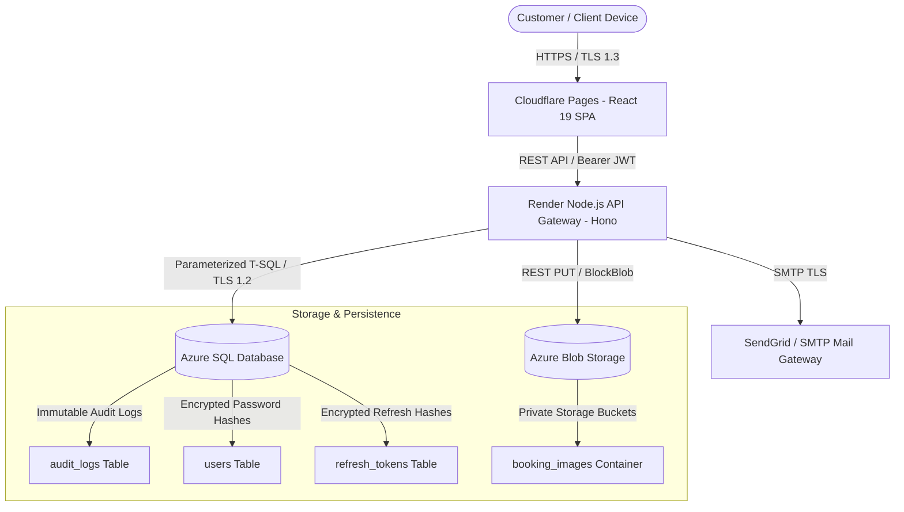

# RemoteFix Enterprise Platform - Data Flow Architecture Map

**Author**: Principal Privacy Engineer & Data Governance Lead  
**Date**: August 6, 2026  
**Scope**: End-to-End Enterprise System Architecture  

---

## 1. System Data Flow Architecture Diagram

---

## 2. Lifecycle Stage Data Mapping

| Data Category | Collection Point | Storage Location | Processing Engine | Transmitted Over | Retention Period | Access Control |
| :--- | :--- | :--- | :--- | :--- | :--- | :--- |
| **User Identity** (Name, Email, Phone) | `POST /api/auth/register` | Azure SQL (`users`, `customers`) | Node.js Hono Engine | TLS 1.3 | Duration of account + 180 days after deletion | Authenticated User & Authorized Admin |
| **Authentication Secrets** (Password Hashes) | `POST /api/auth/login` | Azure SQL (`users.password_hash`) | bcrypt (12 rounds) | In-Memory Only | Permanent until password reset | Hashed System-Only |
| **Session Tokens** (Refresh Token Hashes) | `POST /api/auth/refresh` | Azure SQL (`refresh_tokens.token_hash`) | SHA-256 Digest | TLS 1.3 | 30 Days (Revoked on single-use) | System-Only |
| **Service Bookings** (Device Specs, Address) | `POST /api/bookings` | Azure SQL (`bookings`) | Hono REST API | TLS 1.3 | 7 Years (Financial / Invoice compliance) | Customer, Assigned Tech, Admin |
| **Diagnostic Uploads** (Device Images) | `POST /api/bookings/:id/images` | Azure Blob Storage (`booking_images`) | Magic-Byte Inspection | TLS 1.3 REST | 90 Days post service completion | Private Blob Link via SAS |
| **System Security Logs** (IP, User-Agent) | Request Interceptor | Azure SQL (`audit_logs`) | Structured JSON Logger | TLS 1.3 | 365 Days | Enterprise Compliance Officer |
